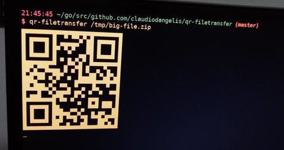

# qr-filetransfer

Transfer files over Wi-Fi from your computer to a mobile device by scanning a QR code without leaving the terminal.


## Install

```
go get github.com/claudiodangelis/qr-filetransfer
```

### Installation through a package manager

[AUR (Arch Linux)](https://aur.archlinux.org/packages/qr-filetransfer-git/)

## How does it work?

This tool binds a web server to the address of your Wi-Fi network interface on a random port, and sets a default handler for it. The default handler serves the content and quits the program when the transfer is complete.

The program prints a QR code that encodes the text:

```
http://{address}:{port}
```

Most QR apps can detect URLs in decoded text and act accordingly (i.e.: open the decoded URL with the default browser), so when the QR code is scanned, the mobile browser starts downloading the content.

## Usage



**Note**: Both computer and device must be on the same Wi-Fi network.

On its first run, `qr-filetransfer` will ask you to choose which **network interface** you want to use to transfer the files. Choose the network interface that is connected to your Wi-Fi:

```
$ qr-filetransfer /tmp/file
Choose the network interface to use (type the number):
[0] enp3s0
[1] wlp0s20u10
```

_Note: On Linux it usually starts with `wl`._

The chosen network will be saved and no more setup is necessary, unless you pass the `-force` argument, or delete the `.qr-filetransfer.json` file in the home directory of the current user.


---


Transfer a single file

```
qr-filetransfer /path/to/file.txt
```

Zip the file, then transfer it

```
qr-filetransfer -zip /path/to/file.txt
```

Transfer a full directory. Note: the **directory gets zipped** before being transferred

```
qr-filetransfer /path/to/directory
```


## Arguments

- `-debug` increases verbosity
- `-force` ignores saved configuration
- `-zip` zips the content before transferring it


## Authors

- [Claudio d'Angelis](claudiodangelis@gmail.com) ([@daw985](https://twitter.com/daw985) on Twitter)

- [You?](https://github.com/claudiodangelis/qr-filetransfer/fork)
