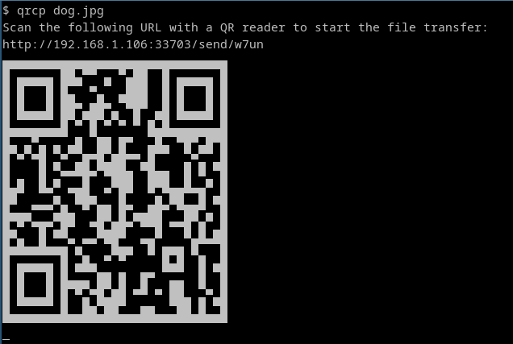

# $ qrcp

Transfer files over Wi-Fi from your computer to a mobile device by scanning a QR code without leaving the terminal.

[](https://goreportcard.com/report/github.com/claudiodangelis/qrcp)

You can support development by donating with  [](https://www.buymeacoffee.com/claudiodangelis).

Join the **Telegram channel** [qrcp_dev](https://t.me/qrcp_dev) for news about the development.

## How does it work?


`qrcp` binds a web server to the address of your Wi-Fi network interface on a random port and creates a handler for it. The default handler serves the content and exits the program when the transfer is complete. When used to receive files, `qrcp` serves an upload page and handles the transfer.

The tool prints a QR code that encodes the text:

```
http://{address}:{port}/{random_path}
```


Most QR apps can detect URLs in decoded text and act accordingly (i.e. open the decoded URL with the default browser), so when the QR code is scanned the content will begin downloading by the mobile browser.

Send files to mobile:


Receive files from mobile:


# Installation

## Install it with Go
    
_Note: it requires go 1.8_

- Download it

    `go get github.com/claudiodangelis/qrcp`

- Copy the executable file to `/usr/local/bin`

    `cp ~/go/bin/qrcp /usr/local/bin`

- Grant execute permission

    `chmod +x /usr/local/bin/qrcp`

## Install the binary

Download the latest binary from the [Releases](https://github.com/claudiodangelis/qr-filetransfer/releases) page to `/usr/local/bin` (or another location in `$PATH`), then set the proper permissions to the binary:

    chmod +x /usr/local/bin/qrcp
    
# Usage


## Send files

### Send a file

```sh
qrcp MyDocument.pdf
```

### Send multiple files at once

When sending multiple files at once, `qrcp` creates a zip archive of the files or folders you want to transfer, and deletes the zip archive once the transfer is complete.

```sh
# Multiple files
qrcp MyDocument.pdf IMG0001.jpg
```

```sh
# A whole folder
qrcp Documents/
```


### Zip a file before transferring it
You can choose to zip a file before transferring it.

```sh
qrcp --zip LongVideo.avi
```


## Receive files

When receiving files, `qrcp` serves an "upload page" through which you can choose files from your mobile.

### Receive files to the current directory

```
qrcp receive
```

### Receive files to a specific directory

```sh
# Note: the folder must exist
qrcp receive --output=/tmp/dir
```


## Options

`qrcp` works without any prior configuration, however, you can choose to configure to use specific values. The `config` command launches a wizard that lets you configure parameters like interface, port, fully-qualified domain name and keep alive.

```sh
qrcp config
```

Note: if some network interfaces are not showing up, use the `--list-all-interfaces` flag to suppress the interfaces' filter.

```sh
qrcp --list-all-interfaces config 
```


### Port

By default `qrcp` listens on a random port. Pass the `--port` (or `-p`) flag to choose a specific one:

```sh
qrcp --port 8080 MyDocument.pdf
```
### Network Interface

`qrcp` will try to automatically find the suitable network interface to use for the transfers. If more than one suitable interface is found ,it asks you to choose one.

If you want to use a specific interface, pass the `--interface` (or `-i`) flag:


```sh
# The webserver will be visible by
# all computers on the tun0's interface network
qrcp -i tun0 MyDocument.dpf
```


You can also use a special interface name, `any`, which binds the web server to `0.0.0.0`, making the web server visible by everyone on any network, even from an external network. 

This is useful when you want to transfer files from your Amazon EC2, Digital Ocean Droplet, Google Cloud Platform Compute Instance or any other VPS.

```sh
qrcp -i any MyDocument.pdf
```


### URL

`qrcp` uses two patterns for the URLs:

- send: `http://{ip address}:{port}/send/{random path}`
- receive: `http://{ip address}:{port}/receive/{random path}`

A few options are available that override these patterns.


Pass the `--path` flag to use a specific path for URLs, for example:

```sh
# The resulting URL will be
# http://{ip address}:{port}/send/x
qrcp --path=x MyDocument.pdf
```

Pass the `--fqdn` (or `-d`) to use a fully qualified domain name instead of the IP. This is useful in combination with `-i any` you are using it from a remote location:

```sh
# The resulting URL will be
# http://example.com:8080/send/xYz9
qrcp --fqdn example.com -i any -p 8080 MyRemoteDocument.pdf
```


### Keep the server alive

It can be useful to keep the server alive after transferring the file, for example, when you want to transfer the same file to multiple devices. You can use the `--keep-alive` flag for that:

```sh
# The server will not shutdown automatically
# after the first transfer
qrcp --keep-alive MyDocument.pdf
```

## Authors

**qrcp**, originally called **qr-filetransfer**, started from an idea of [Claudio d'Angelis](claudiodangelis@gmail.com) ([@daw985](https://twitter.com/daw985) on Twitter), the current maintainer, and it's [developed by the community](https://github.com/claudiodangelis/qrcp/graphs/contributors).


[Join us!](https://github.com/claudiodangelis/qrcp/fork)

## Logo Credits

Logo is provided by [@arasatasaygin](https://github.com/arasatasaygin) as part of the [openlogos](https://github.com/arasatasaygin/openlogos) initiative, a collection of free logos for open source projects.

Check out the rules to claim one: [rules of openlogos](https://github.com/arasatasaygin/openlogos#rules).

## Clones and Similar Projects

- [qr-fileshare](https://github.com/shivensinha4/qr-fileshare) - A similar idea executed in NodeJS with a React interface.
- [instant-file-transfer](https://github.com/maximumdata/instant-file-transfer) _(Uncredited)_ - Node.js project similar to this
- [qr-filetransfer](https://github.com/sdushantha/qr-filetransfer) - Python clone of this project
- [qr-filetransfer](https://github.com/svenkatreddy/qr-filetransfer) - Another Node.js clone of this project
- [qr-transfer-node](https://github.com/codezoned/qr-transfer-node) - Another Node.js clone of this project
- [QRDELIVER](https://github.com/realdennis/qrdeliver) - Node.js project similar to this
- [qrfile](https://github.com/sgbj/qrfile) - Transfer files by scanning a QR code
- [quick-transfer](https://github.com/CodeMan99/quick-transfer) - Node.js clone of this project
- [share-file-qr](https://github.com/pwalch/share-file-qr) - Python re-implementation of this project
- [share-files](https://github.com/antoaravinth/share-files) _(Uncredited)_  - Yet another Node.js clone of this project
- [ezshare](https://github.com/mifi/ezshare) - Another Node.js two way file sharing tool supporting folders and multiple files

## License

MIT. See [LICENSE](LICENSE).
